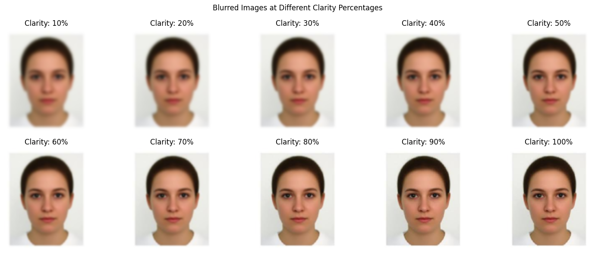
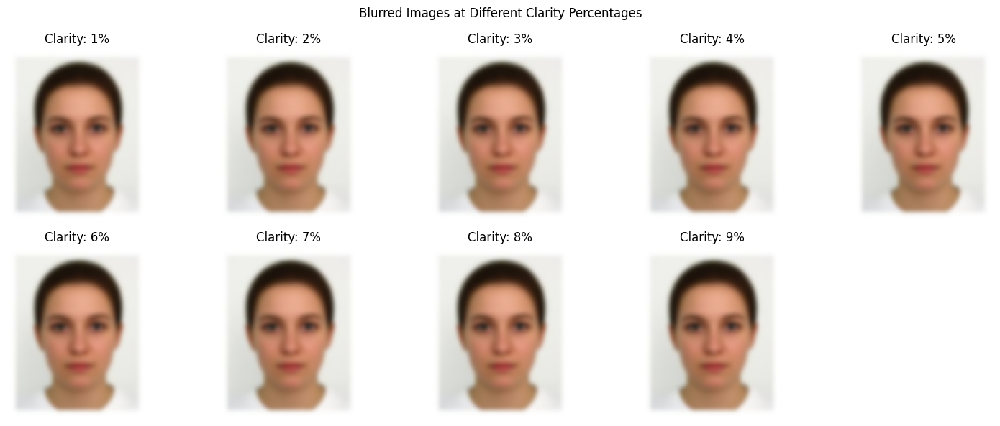
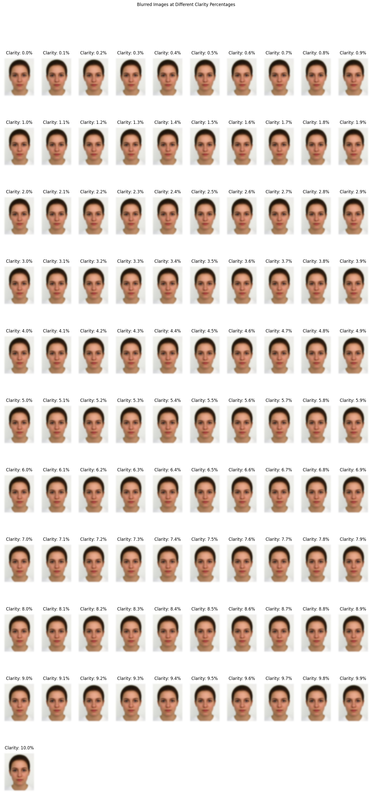

# Image Blur Effect
Demonstrates how to apply a Gaussian blur effect to an image at various levels of clarity using Python. The blur_image function takes an image and a clarity percentage, applying the appropriate amount of blur.

Example Images
Range Run:

Fine-Grained Range Run:
